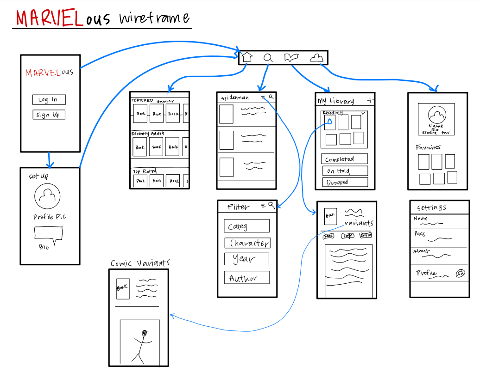
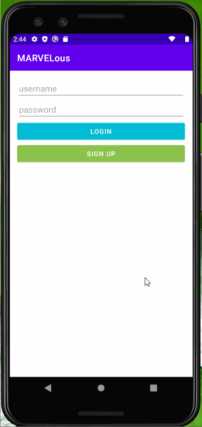
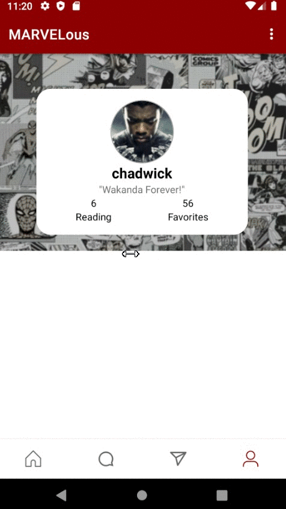
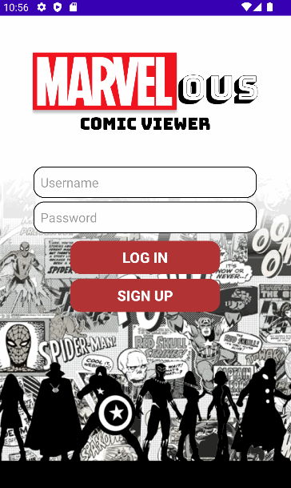
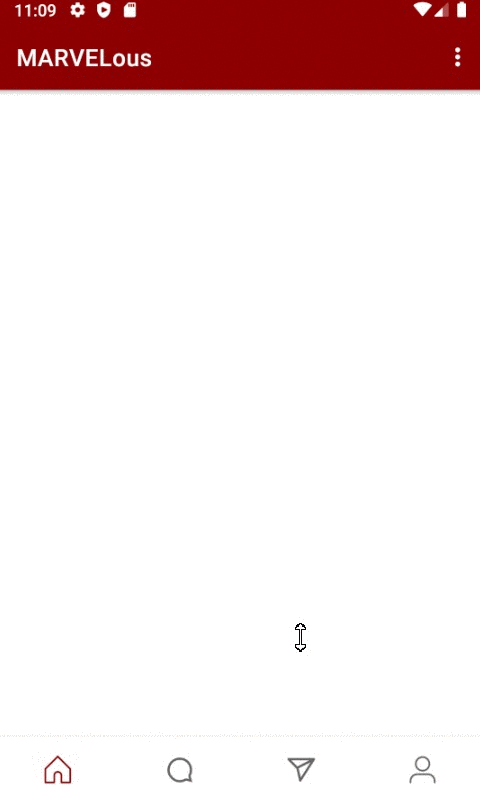
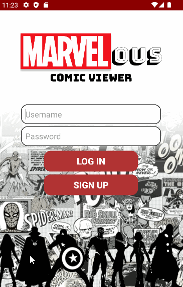
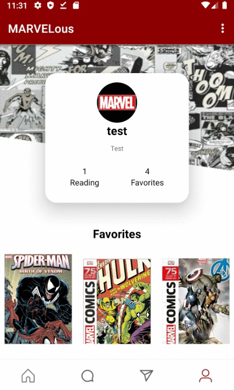
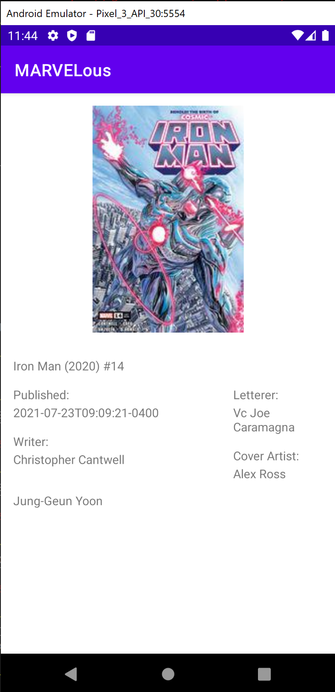

Original App Design Project - README 
===

Group members: **Robert Balatbat, Babak Shajari, Nhat Tran, Napoleon Torrico**

# MARVELous

## Table of Contents
1. [Overview](#Overview)
1. [Product Spec](#Product-Spec)
1. [Wireframes](#Wireframes)
2. [Schema](#Schema)

## Overview
### Description
"MARVELous" is a Marvel comic book reader powered by Marvel Comics API. Readers can navigate through their library, leave reviews of comics they have read, and much more. This app also features a social environment for like-minded comic book readers with the ability to follow accounts, view other readers' reviews, and even rate their reviews. Discover new comics with a built-in search feature that can filter for your favorite heroes, teams, and even villains. 

### App Evaluation
[Evaluation of your app across the following attributes]
- **Category:** Social Networking / Entertainment
- **Mobile:** This app is primarily developed for mobile but it is possible for use on a computer, such as https://anilist.co/. In the possibilities of a web version being created, it would have very similar features to the mobile app.
- **Story:** Allows readers to keep track of which comics they are currently reading, have read, plan to read, etc. Readers can follow others and see their reviews/library. Users can also search for new comics through a filter to find exactly what they want.
- **Market:** Any Marvel comic fan would be benefited by this app. Could be marketed towards an older audience since some comics may have sensitive material.
- **Habit:** This app could be used as much as they read Marvel comics. If they get to a certain point in an issue, they can bookmark their progress. They can also log if they completed the comic or dropped it.
- **Scope:** First, this can begin as a comic logger app. Then it can evolve into a fully social app with live discussions, posts, memes, etc. 

## Product Spec

### 1. User Stories (Required and Optional)

**Required Must-have Stories**
- [X] User can register for a new account, and this gets stored to a database for the user to log in later.
- [X] Bottom toolbar allows for navigation to different fragments: Home, Search, Library, Account
- [ ] Home tab displays top rated comics and most read comics.
- [X] Search tab displays filters which can help the user find a specific comic.
    - In progress, category filters
- [X] Library tab displays tabs for users specific comics: Reading, Completed, On Hold, Dropped, Plan to Watch.
- [X] Account tab shows user info.
- [X] User can customize their account page with a biography, profile picture, and username.
- [ ] Users should be able to click a comic anywhere in the app and see the info of that app.
- [ ] Users should be able to favorite a comic.

**Optional Nice-to-have Stories**
- [ ] Home tab displays comics user may like (using user's info).
- [ ] Users should be able to leave reviews on comics.
- [ ] Popups can be used for a smooth experience (but fragments could be used in place of this).
- [ ] Users can like or dislike other people's reviews.
- [ ] Users can follow other users and view their pages.
- [X] UI similar to the figma page.
     - Continuous Progress
- [ ] Live discussion posts.
- [ ] User can see comic variants.
- [ ] User can see the review and their page number under each comic cover thumbnail.

### 2. Screen Archetypes

* Login/Register Screen
   * User can register for a new account and login to this account.
* Home Screen
   * User can view the top rated comics and most read comics.
   * Most visual tab of the four tabs.
* Search Screen
   * User can search for the particular comic that they want to read.
   * Variety of search filters.
* Library Screen
   * Reader can see their specific comics: Reading, Completed, On Hold, Dropped, Plan to Watch.
* Account Screen
   * User can access settings and logout.
   * Shows user profile picture, biography, favorite comics, etc.

### 3. Navigation

**Tab Navigation** (Tab to Screen)

* Home
* Search
* Library
* Account

**Flow Navigation** (Screen to Screen)

* Login Screen
   * Home Screen
* Home Screen
   * Review Screen
      * Review Page
      * Comic Cover Variant Screen
* Search Screen
   * Filter Screen  
   * Review Screen
      * Review Page
      * Comic Cover Variant Screen
* Library Screen
   * Review Screen
      * Review Page
      * Comic Cover Variant Screen
* Account Screen
   * Settings Screen
   * Review Screen
      * Review Page
      * Comic Cover Variant Screen 

## Wireframes


### [BONUS] Digital Wireframes & Mockups


### [BONUS] Interactive Prototype


Link with Interactions:

https://www.figma.com/proto/O9zBfIWDuVDtPXTtEKOKWa/Comic-Book-App?node-id=6%3A2&scaling=scale-down&page-id=0%3A1&starting-point-node-id=6%3A2

## Schema 
### Models

User
| Property  | Type | Description |
| ------------- | ------------- | -------------|
| userId | int  | unique id for the user (default field) |
| userName | String  | unique username for the user |
| firstName  | String  | user's first name |
| lastName  | String  | user's last name |
| dateCreated | DateTime  | date when account was created (default field) |
| profilePic | File  | stores user's profile picture |
| password  | String  | stores user's password |

User-Comic
| Property  | Type | Description |
| ------------- | ------------- | -------------|
| objectId | String | unique id for the user-comic relationship (default field) |
| comicId | int | Stores the unique id for each comic book to reference the API. |
| userId | Pointer to User | Unique id for the user; used to associate each comic book with a user. |
| isFavorite | boolean | Determines whether the user has marked this comic as their favorite. |
| pageNumber | int | Determines which page number the user is on. |
| status | String | Determines status of comic: Reading, Completed, On Hold, Dropped, Plan to Watch |
| reviewNum | int | Numerical review for the comic |
| reviewPost | String | User review for the comic |

Posts (For optional Live-Discussion)
| Property  | Type | Description |
| ------------- | ------------- | -------------|
| objectId | String | unique id for the user post (default field) |
| comicId | int | Stores the unique id for each comic book to reference the API. |
| userId | Pointer to User | Unique id for the user; used to associate each comic book with a user. |
| description | String | Message user can send in discussion post. |
| createdAt | DateTime | Logs the time post was sent. (default field) |
| updatedAt | DateTime | Detects when post was updated. (default field) |

### Networking
- Home Screen
  - (Read/GET) Query new comics
     ```swift
     let query = PFQuery(className:"Comic")
     query.order(byDescending: "publishedDate")
     query.findObjectsInBackground { (comics: [PFObject]?, error: Error?) in
        if let error = error { 
           print(error.localizedDescription)
        } else if let comics = comics {
           print("Successfully retrieved \(comics.count) comics.")
       // TODO: Do something with comics...
        }
     }
     ```
- Create Post Screen
  - (Create/POST) Create a new post object
- Profile Screen
  - (Read/GET) Query logged in user object
  - (Update/PUT) Update user profile image

#### [OPTIONAL: List endpoints if using existing API such as Yelp]
##### The API Of Marvel Developer
- Base URL - [https://gateway.marvel.com/](https://gateway.marvel.com/)

   HTTP Verb | Endpoint | Description
   ----------|----------|------------
    `GET`    | /v1/public/comics | fetches lists of comics
    `GET`    | /v1/public/comics/{comicId} | fetches a single comic by id
    `GET`    | /v1/public/comics/{comicId}/stories   | fetches lists of stories filtered by a comic id
    `GET`    | /v1/public/comics/{comicId}/characters | fetches lists of charactors filtered by a comic id
    `GET`    | /v1/public/comics/{comicId}/variants | fetches a list of variant filtered by a comic id

##### The API Of Back4app
- Base URL - [https://parseapi.back4app.com/](https://parseapi.back4app.com/)

   HTTP Verb | Endpoint | Description
   ----------|----------|------------
    `GET`    | /users | get all users
    `GET`    | /users/?name=name| return specific user by name
    
##### Sprint 1 Progress
GIFS:
Login Screen and Bottom Nav:



Profile Fragment Progresss with Scrollable Effect and Username, profile picture, and biography:



LoginActivity with Signup and Login with Parse



##### Sprint 2 Progress
GIFS:

Settings Activity with Preferences Fragment: 



Library Fragment Progress: 


##### Sprint 3 Progress
GIFS:

Sign Up Activity Progress with Email and Sign Up Page:



Account Page Completion and Search Fragment Progress:



Comic Detail Progress:



##### Sprint 4
GIFS and IMAGES: 

Search Fragment and Comic Detail Activity:


Email Verification:


